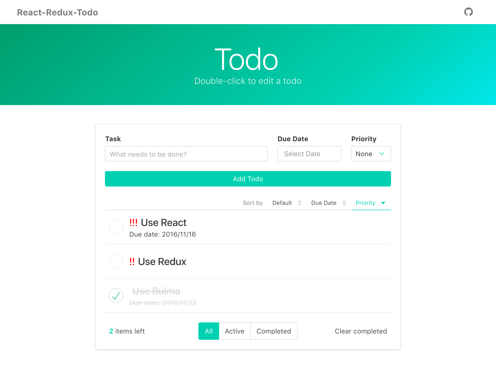

# React-Redux-Todo

A Todo app built with `React`, `redux`, `ES6`, [Bulma CSS framework](http://bulma.io/) and [react-dates](https://github.com/airbnb/react-dates).

This project is adapted from the [Redux TodoMVC Example](https://github.com/reactjs/redux/tree/master/examples/todomvc).

[](https://waynelai614.github.io/react-redux-todo/)

[DEMO](https://waynelai614.github.io/react-redux-todo/)

## How to run

```
npm install

npm start
```
Visit [http://localhost:3000/](http://localhost:3000/).
